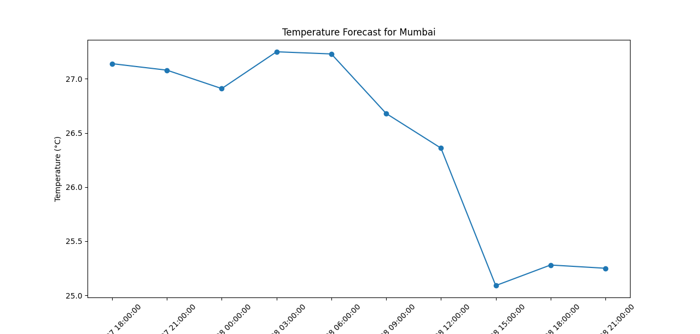

# API-INTEGRATION-AND-DATA-VISUALIZATION
****
*COMPANY*: CODTECH IT SOLUTIONS
*NAME*: Rasika Nagesh Tambe
*INTERN ID*: CT06DZ73
*DOMAINA*: PYTHON
*DURATION*: 6 WEEK
*MENTOR* : NEELA SANTOSH

---

# 🌦️ Weather Forecast Visualization

This project fetches weather forecast data from the **OpenWeatherMap API** and visualizes the temperature trends for a selected city using **Python** and **Matplotlib**.

## 📌 Features

* Fetches 5-day/3-hour interval weather forecast from OpenWeatherMap.
* Extracts **temperature** and **timestamp** values.

* Generates a simple **line plot** of the forecasted temperature.
* Supports customization for any city worldwide.


## 📂 Project Structure

```
├── task1_api.py       # Main script for fetching and plotting weather data
├── task1 code.txt     # Alternate script version
├── Figure_1.png       # Sample output plot for Mumbai
└── README.md          # Project documentation
```

## 🚀 Getting Started

### 1️⃣ Clone the Repository

```bash
git clone https://github.com/your-username/weather-forecast-plot.git
cd weather-forecast-plot
```

### 2️⃣ Install Dependencies

Make sure you have Python 3 installed. Install required libraries:

```bash
pip install requests matplotlib
```

### 3️⃣ Get an OpenWeatherMap API Key

* Sign up at [OpenWeatherMap](https://openweathermap.org/api).
* Generate a free API key.
* Replace the placeholder in the script:

```python
API_KEY = "YOUR_API_KEY"
```

### 4️⃣ Run the Script

```bash
python task1_api.py
```

## 📊 Example Output

Here’s a sample temperature forecast for **Mumbai**:



## ⚙️ Customization

To change the city, update the `CITY` variable in the script:

```python
CITY = "Delhi"
```

## 🛠️ Built With

* [Python](https://www.python.org/)
* [Requests](https://docs.python-requests.org/en/latest/)
* [Matplotlib](https://matplotlib.org/)
* [OpenWeatherMap API](https://openweathermap.org/api)

## 📜 License

This project is licensed under the MIT License. Feel free to use and modify it.

---

Would you like me to also **add instructions for saving the chart directly as an image (PNG)** instead of only showing it? That way the script can automatically generate the output like your `Figure_1.png`.
